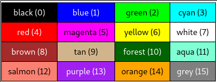

# Documentation

## Index

- [Initialization](#initialization)
- [Basic operators](#basic-operators)
  * [Binary operators](#binary-operators)
  * [Unary operators](#unary-operators)
  * [Numeric Predicates](#numeric-predicates)
  * [Logic operators](#logic-operators)
- [String literals](#string-literals)
- [Variables](#variables)
  * [Definition](#definition)
  * [Reference](#reference)
- [Functions](#functions)
  * [Definition](#definition)
  * [Call](#call)
- [Control stuctures](#Control-stuctures)
  * [REPEAT](#REPEAT)
  * [IF](#IF)
  * [IFELSE](#IFELSE)
  * [FOR](#FOR)
  * [WHILE](#WHILE)
  * [DO.WHILE](#DO.WHILE)
  * [UNTIL](#UNTIL)
  * [DO.UNTIL](#DO.UNTIL)
- [Graphics](#graphics)
  * [FORWARD](#FORWARD)
  * [BACK](#BACK)
  * [LEFT](#LEFT)
  * [RIGHT](#RIGHT)
  * [SETEADING](#SETEADING)
  * [SETXY](#SETXY)
  * [SETX](#SETX)
  * [SETY](#SETY)
  * [PENUP](#PENUP)
  * [PENDOWN](#PENDOWN)
  * [SETPENCOLOR](#SETPENCOLOR)
  * [Colors](#Colors)

## Initialization

At the top of every source file, is mandatory to write the statements listed below. The order is also mandatory.

- `canvasSize <width> <height>` : Sets the canva's width and height.
- `backColor <color>` : Sets the canva's background color.

Example:
```
/* Sets the canvas size 500px x 500px */
canvasSize 500 500
backColor 1
```

## Basic operators

### Binary operators

All binary operators are infix operators

- `<n> + <m>` : Common plus operator.
- `<n> - <m>` : Common substraction operator.
- `<n> * <m>` : Common multiplication operator.
- `<n> / <m>` : Common division operator.

### Unary operators
- `- <n>` : Returns the opossite of n.
- `MINUS <n>` : Returns the opossite of n.
- `INT <n>` : Removes the fractional part of n.
- `ROUND <n>` : Returns the nearest integer in n.
- `SQRT <n>` : Returns the square root of n.
- `EXP <n>`: Returns e^n.
- `LN <n>`: Returns the natural logarithm of n.
- `LOG10 <n>` : Returns the logarithm of n (base 10).
- `SIN <n>` : Returns the sine of n, n must be in degrees.
- `RADSIN <n>` : Returns the sine of n, n must be in radians.
- `COSSIN <n>` : Returns the cosine of n, n must be in degrees.
- `RADCOS <n>` : Returns the cosine of n, n must be in radians.
- `ARCTAN <n>` : Returns the arctangent of n, n must be in degrees.
- `RADARCTAN <n>` : Returns the arctangent of n, n must be in radians.

### Numeric Predicates

- LESSP:
  - `LESSP <n> <m>`
  - `LESS? <n> <m>`
  - `<n> < <m>`

Returns true if n is less than m. Otherwise returns false.


- LESSEQUALP:
  - `LESSEQUALP <n> <m>`
  - `LESSEQUAL? <n> <m>`
  - `<n> <= <m>`

Returns true if n is grater or equal than m. Otherwise returns false.

- GREATERP:
  - `GREATERP <n> <m>`
  - `GREATER? <n> <m>`
  - `<n> > <m>`

Returns true if n is grater than m. Otherwise returns false.

- GREATEREQUALP:
  - `GREATEREQUALP <n> <m>`
  - `GREATEREQUAL? <n> <m>`
  - `<n> >= <m>`

Returns true if n is grater or equal than m. Otherwise returns false.

- EQUALP:
  - `EQUALP <n> <m>`
  - `EQUAL? <n> <m>`
  - `<n> = <m>`

Returns true if n is equal to m. Otherwise returns false.

### Logic operators

- `p AND q` : Returns true if p and q are true. Otherwise returns false.
- `p OR q` : Returns true if either p or q are true. Otherwise returns false.
- `NOT p` : Returns true if p is false. Returns false if p is true.

## String literals

To reference an string literal we must prepend `"` to the word. For example, if we want to reference the word `hello` we must write `"hello`. This is used to define variable names.

## Variables

### Definition

- `MAKE <name> <expression>`

  Declares a global variable. `<name>` is an string literal and `<expression>` is either a boolean expression or a numeric expression. Variable names are case insensitive. We can redefine a variable's value by invoking `MAKE` again. Example:

  ```
  MAKE "x 1 + 2     ; We declare x with the value 3
  MAKE "x 4         ; We redefine x with the value 5
  ```

- `LOCALMAKE <name> <expression>`

  Same as `MAKE` but for function's local scope.

  ### Reference

  To reference a variable you must prepend `:` to the variable name. For example:

  ```
  MAKE "x 1 + 2     ; We declare x with the value 3
  MAKE "y 4         ; We declare y with the value 4

  MAKE "x :x + :y   ; We redefine x with the value of x + y = 7
  ```

## Functions

### Definition

Functions are defined with the `TO` statement:

```
TO <name> :x1 :x2 ... :xn [:y1 e1] [:y2 e2] ... [:ym em]
  <function statements>
END
```
- `<name>` : Function's name (it's NOT an string literal).
- `:x1 :x2 ... :xn` : Function's mandatory arguments. You are always required to call the function with this arguments.
- `[:y1 e1] [:y2 e2] ... [:ym em]` : Function's optional arguments. You dont need to call the function with this arguments. If you don't use them, these arguments will take the value of the expression that accompanies them.

Mandatory arguments always come before optionals. Recursion is supported by the language.

Example:

```
TO TRIANGLE :a [:b 5] [:c 5] [:d 5]
  setpc :b
  fd :a
  rt 360 / 3
  setpc :c
  fd :a
  rt 360 / 3
  setpc :d
  fd :a
END
```

In the example above we are defining a function named `TRIANGLE` with only one mandatory argument (`:a`) and three optional arguments (`:b`, `:c` and `:d`).

### Call

To call a function you must use the statement `CALL`. Form example:

```
;Runtime error, no arguments given (:a is mandatory)
CALL TRIANGLE

;Calls the function with only the mandatory argument defined
CALL TRIANGLE 100

;Calls the function with the mandatory argument defined and the first optional defined
CALL TRIANGLE 100 1

;Calls the function with the mandatory argument defined and the first and second optional defined
CALL TRIANGLE 100 1 2

;Calls the function with the mandatory argument defined and the first, second and third optional defined
CALL TRIANGLE 100 1 2 3

;Runtime error, too many arguments :)
CALL TRIANGLE 100 1 2 3 4
```

## Control stuctures

### REPEAT
- `REPEAT <n> [statements]`

  Repeats n times `[statements]`. This statement automatically defines a local variable called `repcount` that tells us which iteration we are executing. Example

  ```
  repeat 15 [
    fd 100
    bk 100
    rt 5
  ]
  ```

### IF
- `IF <boolean expression> [statements]`
- `IF <boolean expression> [statements1] [statements2]`

  Evaluates the `<boolean expression>`:
    - If the expression evaluates to `TRUE` then `[statements]` is executed.
    - If the expression evaluates to `FALSE` then nothing happens.

  If the second statement list is present, `IF` acts like `IFELSE` described below.

### IFELSE
- `IF <boolean expression> [statements1] [statements2]`

  Evaluates the `<boolean expression>`:
    - If the expression evaluates to `TRUE` then `[statements1]` is executed.
    - If the expression evaluates to `FALSE` then `[statements2]` is executed.

### FOR
- `FOR [for control] [statements]`

  Executes `[statements]` until the initial and final value inside `[for control]` are equal. `[for control]` has the following structure:

  `[<local variable> <initial value> <final value> <step size>]`
    - `<local variable>` : Name of the local variable that us tells us which step we are executing. At the beginning takes the value of `<initial value>`. At each iteration we update it adding the step size.
    - `<initial value>` : Initial value of the interation.
    - `<final value>` : Final value of the interation.
    - `<step size>` : This parameter is optional. Represents the step size between iterations.
      - If we do not define it and `<initial value>` is less than `<final value>` the compiler will automatically define it as 1.
      - If we do not define it and `<initial value>` is greater than `<final value>` the compiler will automatically define it as -1.

  Examples:
  ```
  for [i 0 10 2] [
    forward i
    rt 20
    setpencolor i
  ]

  for [i 0 9 1.5] [
    forward i
    rt 20
    setpencolor i
  ]

  for [i 10 0 -2] [
    forward i
    rt 20
    setpencolor i
  ]
  ```

### WHILE
- `WHILE <boolean expression> [statements]`

  Executes `[statements]` until `<boolean expression>` evaluates to `FALSE`. This control structure evaluates the `<boolean expression>` first and then executes `[statements]`.

### DO.WHILE
- `DO.WHILE [statements] <boolean expression>`

  Executes `[statements]` until `<boolean expression>` evaluates to `FALSE`. This control structure executes `[statements]` first then evaluates the `<boolean expression>`.

### UNTIL
- `UNTIL <boolean expression> [statements]`

  Executes `[statements]` until `<boolean expression>` evaluates to `TRUE`. This control structure evaluates the `<boolean expression>` first and then executes `[statements]`.

### DO.UNTIL
- `DO.UNTIL [statements] <boolean expression>`

  Executes `[statements]` until `<boolean expression>` evaluates to `TRUE`. This control structure executes `[statements]` first then evaluates the `<boolean expression>`.

## Graphics

The whole purpose of this compiler is to draw images! To achieve that, we use an imaginary magic pen with million of colors in it. Imagine this pen as a cursor that is always poiting to a certain direction in a 2D canvas and can move forward and backwards to draw images. Below are listed all the commands you can use to control the magic pen.
Its starting position is at the center of the canvas, 90 degrees (heading north) and writing color black.

### FORWARD

- `FORWARD <steps>`
- `FD <step>`

Draws `<steps>` pixel forward to the direction that the magic pen is heading.

### BACK

- `BACK <steps>`
- `BK <step>`

Draws `<steps>` pixel backwards to the direction that the magic pen is heading.

### LEFT

- `LEFT <angle>`
- `LT <angle>`

Turns the head of the magic pen `<angle>` degrees counter-clockwise.

### RIGHT

- `RIGHT <angle>`
- `RT <angle>`

Turns the head of the magic pen `<angle>` degrees clockwise.

### SETEADING

- `SETEADING <angle>`

Sets the magic pen angle to `<angle>`.

### SETXY

- `SETXY <x> <y>`

Moves the magic pen to coordinates (`<x>`, `<y>`).

### SETX

- `SETX <x>`

Moves the magic pen horizonally to `<x>`.

### SETY

- `SETY <y>`

Moves the magic pen vertically to `<y>`.

### PENUP

- `PENUP`
- `PU`

Raises the pen from the canvas. If we go forward or backwards it won't to draw anything.

### PENDOWN

- `PENDOWN`
- `PD`

Puts the pen in the canvas. If we go forward or backwards it will draw a line.

### SETPENCOLOR

- `SETPENCOLOR <color>`
- `SETPC <color>`

Change the color of the magic pen to `<color>`.

### Colors

The language has 16 predefined colors that we can use and also allows the user to input any color in RGB format.




Example:

```
SETPC 2             ;Changes the magic pen color to green (2 in the table)
SETPC aqua          ;Changes the magic pen color to aqua (11 in the table)
SETPC [128 54 210]  ;Changes the magic pen color to RGB 128 54 210
```