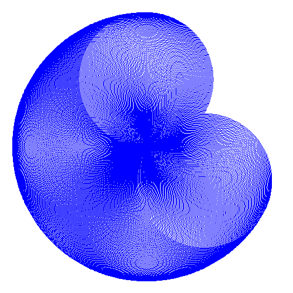

# Mini Logo

An implementation of a subset of the Berkeley Logo 6.0 language (with some tiny differences)

# Installation

## Dependencies

- libgd-dev >= 2.2.5-5.2
- ghc >= 8.4.4
- cabal-install >= 2.2.0.0-2

## Instructions

```
cabal update
cabal install
cabal build
```

# Execution

Once the project is built, to compile a program you can execute:

```
cabal run <path to source> <path to output>
```

NOTE: The compiler will automatically attach the ".png" extension to the output.

# Documentation
The documentations is a little extensive, so I placed it in [another document](../main/Documentation.md)

# Showcase

Here are some compiled examples.





